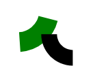

# Drawing SVG annulus sectors with Clojurescript

What is an [annulus](https://en.wikipedia.org/wiki/Annulus_(mathematics))? it's basically a mathsy word for a 2d donut. An annulus *sector* is a wedge cut out of the donut. It looks like this:


Why would you want to draw one? The first thing that springs to mind is drawing pieces of a pie chart but I actually wanted them for [my Clojurescript implementation](https://github.com/tomisme/tzolkin) of the [Tzolk'in boardgame](https://www.boardgamegeek.com/boardgame/126163/tzolk-mayan-calendar). I haven't (yet?) finished the game but the WIP code helped me land my first programming job a few years ago, so you could say drawing annulus sectors helps you find work!

## The ugly hack way

[Click here to skip the ramble and see how I do it now]()

Some context: in the Tzolk'in boardgame you place worker-pieces on slowly spinning gears that resemble the image below (the real game board is much prettier):


Around the gear are annulus sectors that label the action you take when removing a worker from the corresponding space on the gear.

So for my first pass at implementing the game I decided to not bother learning to draw these properly and instead do this:

```clj
  [:g
   ;; draw a big colored circle
   [:circle {:style {:fill gear-color}
             :r r
             :cx cx
             :cy cy}]
   ;; draw a smaller white circle
   [:circle {:style {:fill "white"}
             :r (* r 1.4)
             :cx cx
             :cy cy}]
   ;; draw a white separator between each action label
   (for [tooth (range num-teeth)
         :let [width (* r 0.1)
               deg (* tooth (/ 360 num-teeth))]]
     [:rect {:x (- cx (/ width 2))
             :y (+ cy (/ r 3.6))
             :width width
             :height (* r 1.6)
             :style {:fill "white"}
             :transform (transform-str [:rotate {:deg deg :x cx :y cy}])}])
```

Here's that gear again with the separators in blue:


Bad idea for lots of reasons, including:
 - Basically impossible to animate or even highlight individual 'sectors' on mouse-over.
 - Basically impossible to use the shapes for any other purpose. Eventually I wanted to add cool tooltips with rotated labels so they were easy to read.

The silly line cutout method served its purpose for a while but eventually I needed a better approach. Next I tried drawing some sectors manually using two different methods, to see which would be easier to do programatically:

## Working out a better way

```clj
(def manual-annulus-sectors
  [:svg {:width 150 :height 150}
   ;; the 'manual path' method
   [:path {:d "M 80 80
               A 40 40 0 0 0 120 120
               L 120 100
               A 20 20 0 0 1 100 80
               Z"}]
   ;; the 'stroke-dasharray' method
   [:circle {:cx 50 :cy 50 :r 40 :fill "transparent"
             :stroke-width 25
             :stroke "green"
             :stroke-dasharray "50 1000"
             :stroke-dashoffset -10}]])
```

Here's what gets rendered:



I won't go into too much detail about the 'manual path' method, it quickly became apparent that writing a function to generate the shapes I wanted using an SVG path would be beyond my abilities. It was hard enough drawing one manually! It was the 'stroke-dasharray' method that I eventually stuck with.

## Back to circles

Adding the [stroke-dasharray](https://developer.mozilla.org/en-US/docs/Web/SVG/Attribute/stroke-dasharray) attribute to an SVG shape (like a circle) let's you change a solid border into a pattern of dashes and gaps. We can draw our annulus sector by...

```clj
(defn action-label-el
  [{:keys [color cx cy r length]}]
  (let [circumference (* 2 pi r)
        width (/ r 2.8)]
    [:g
     [:circle {:cx cx :cy cy :r r
               :fill "transparent"
               :stroke-width width
               :stroke color
               :stroke-dasharray (str length " 1000")}]
     (let [arc-deg (/ (* length 180) (* pi r))
           deg (+ 90 (/ arc-deg 2))]
       [:g {:transform (transform-str [:rotate {:deg deg
                                                :x cx
                                                :y cy}])}
```

## Bonus Round: Positioning things around a circle


